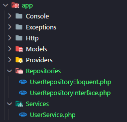
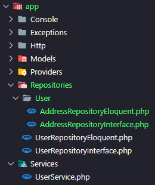

# Layers

A laravel package to generate files for layered architecture and automate interface bindings.

**Recommended Laravel version:** `^9.0`

Go to [Laravel Docs](https://laravel.com/docs/9.x/releases#support-policy) to see support policy.

## Summary
- <a href="#requirements">Requirements</a>
- <a href="#installation">Installation</a>
- <a href="#configuration">Configuration</a>
- <a href="#usage">Usage</a>
  - <a href="#generate-layers">Generate Layers</a>
  - <a href="#generate-layers-with-subfolders">Generate Layers with Subfolders</a>
  - <a href="#generate-services-with-more-than-one-repository">Generate Services with more than one repository</a>

## Requirements

```json
"php": "^8.0.2"
"symfony/finder": "^6.3"
"illuminate/support": "^9.0 || ^10.20"
"illuminate/console": "^9.0 || ^10.20"
```

## Installation

```bash
composer require williamjss/layers
```

## Configuration

```bash
php artisan vendor:publish --tag=layers
```

**This command will copy Layers config to your project config folder**

```php
<?php

return [

    'namespace' => [
        'repositories' => 'Repositories',
        'services' => 'Services',
    ],

    'path' => [
        'models' => app_path('Models'),
        'repositories' => app_path('Repositories'),
        'services' => app_path('Services'),
    ]
];

```

Into this file, you can switch the services/repositories default path. For this, keep the namespace and path keys both equals.

## Usage

Using the `layers` artisan command, we can be generate files for repositories (interface and eloquent) and services.

`php artisan layers` + `{option}` + `{model name}`

Available options:

- **-e** or **--eloquent** : Generate a repository eloquent for the model
- **-i** or **--interface** : Generate a repository interface for the model
- **-s** or **--service** : Generate a service for the model
- **-r** or **--repository** : Generate a repository interface and eloquent for the model
- **-a** or **--all** : Generate a service, repository interface and repository eloquent for the model
- **--wr** : Specify the service's repositories

*Subcommands*
- `php artisan layers:repository --eloquent` : the same as ***php artisan layers --eloquent***
- `php artisan layers:repository --interface` : the same as ***php artisan layers --interface***
- `php artisan layers:service` : the same as ***php artisan layers --service***
- `php artisan layers:binds` : List all binds from application 

### Generate Layers
```bash
php artisan layers --all User
```

**This command will generate 3 files:**
- app/Repositories/UserRepositoryInterface.php
- app/Repositories/UserRepositoryEloquent.php
- app/Services/UserService.php



#### UserRepositoryInterface.php
```php
<?php

namespace App\Repositories\User;

use App\Models\User;

interface UserRepositoryInterface
{
    public function __construct(User $user);

    /**
     * Stores a new instance of User in the database
     * @param \Illuminate\Support\Collection|array|int|string $data
     * @return User
     */
    public function store($data);

    /**
     * Returns all instances of User from the database
     * @param array|string $columns
     * @param array<array> $filters
     * @return \Illuminate\Database\Eloquent\Collection<int, static>
     */
    public function getList($columns=['*'], $filters=null);

    /**
     * Returns an instance of User from the given id
     * @param int|string $id
     * @return User
     */
    public function get($id);

    /**
     * Updates the data of an instance of User
     * @param \Illuminate\Support\Collection|array|int|string $data
     * @param int|string $id
     * @return User
     */
    public function update($data, $id);

    /**
     * Removes an instance of User from the database
     * @param int|string $id
     * @return int
     */
    public function destroy($id);
}
```

#### UserRepositoryEloquent.php
```php
<?php

namespace App\Repositories;

use App\Models\User;

class UserRepositoryEloquent implements UserRepositoryInterface
{
    protected $user;

    public function __construct(User $user)
    {
        $this->user = $user;
    }

    /**
     * Stores a new instance of User in the database
     * @param \Illuminate\Support\Collection|array|int|string $data
     * @return User
     */
    public function store($data)
    {
        return $this->user->create($data);
    }

    /**
     * Returns all instances of User from the database
     * @param array|string $columns
     * @param array<array> $filters
     * @return \Illuminate\Database\Eloquent\Collection<int, static>
     */
    public function getList($columns=['*'], $filters=null)
    {
        return $this->user->where($filters)->get($columns);
    }

    /**
     * Returns an instance of User from the given id
     * @param int|string $id
     * @return User
     */
    public function get($id)
    {
        return $this->user->find($id);
    }

    /**
     * Updates the data of an instance of User
     * @param \Illuminate\Support\Collection|array|int|string $data
     * @param int|string $id
     * @return User
     */
    public function update($data, $id)
    {
        $user = $this->user->find($id);
        $user->update($data);
        return $user;
    }

    /**
     * Removes an instance of User from the database
     * @param int|string $id
     * @return int
     */
    public function destroy($id)
    {
        return $this->user->find($id)->delete();
    }
}

```

#### UserService.php
```php
<?php

namespace App\Services;

use App\Repositories\UserRepositoryInterface;

class UserService
{
    private $repoUser;

    public function __construct(
        UserRepositoryInterface $repoUser,
    )
    {
        $this->repoUser = $repoUser;
    }

    // Add your functions here...
}

```

### Generate Layers with Subfolders
```bash
php artisan layers --repository User.Address
```

**This command will generate 2 files:**
- app/Repositories/User/AddressRepositoryInterface.php
- app/Repositories/User/AddressRepositoryEloquent.php



### Generate Services with more than one repository
```bash
php artisan layers --service --wr=Address --wr=User Person
```

**This command will generate the follow file:**

```php
<?php

namespace App\Services;

use App\Repositories\UserRepositoryInterface;
use App\Repositories\User\AddressRepositoryInterface;

class PersonService
{
    private $repoAddress;
    private $repoUser;

    public function __construct(
        AddressRepositoryInterface $repoAddress,
        UserRepositoryInterface $repoUser,
    )
    {
        $this->repoAddress = $repoAddress;
        $this->repoUser = $repoUser;
    }

    // Add your functions here...
}

```
